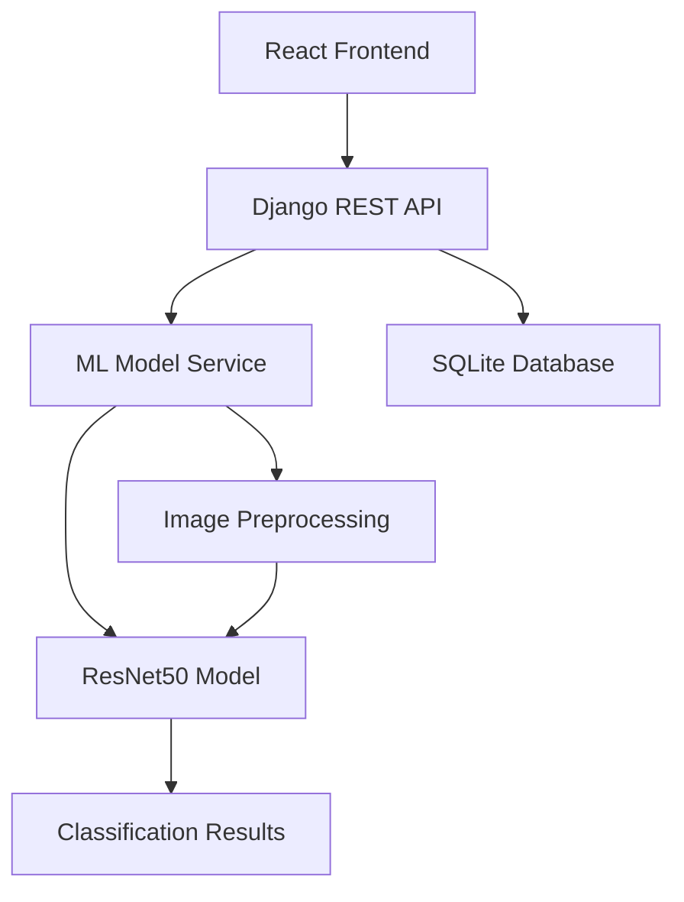

<div align="center">


</div>

<div align="center">

[](https://git.io/typing-svg)


</div>

---

<div align="center">


</div>

## PROJECT OVERVIEW

**AI Media Authenticity Detector** is an academic research project focused on developing machine learning models for image classification and authenticity verification. This project explores the application of convolutional neural networks, specifically ResNet50 with transfer learning, to distinguish between authentic and potentially manipulated digital images.

### Project Scope & Objectives

The system combines modern web technologies with deep learning frameworks to create a complete pipeline for image analysis, from data preprocessing to model inference and user interface presentation.

**Key Components:**
- **Machine Learning Pipeline**: Image preprocessing, data augmentation, and ResNet50-based classification
- **Backend API**: Django REST Framework for model serving and data management  
- **Frontend Interface**: React-based web application for user interaction
- **Containerization**: Docker setup for consistent deployment environments

### Technical Specifications

<div align="center">

| **Component** | **Technology** | **Purpose** |
|:-------------|:---------------|:------------|
| **Model Architecture** | ResNet50 Transfer Learning | Feature extraction and classification |
| **Training Framework** | TensorFlow/Keras | Model development and training |
| **Backend API** | Django REST Framework | Model serving and data handling |
| **Frontend** | React + JavaScript | User interface and interaction |
| **Deployment** | Docker Compose | Container orchestration |

</div>

---

<div align="center">


</div>

## TECHNICAL ARCHITECTURE

<div align="center">

### Machine Learning & Data Processing


### Backend Development


### Frontend Development


### Development & Deployment


</div>

### System Architecture

<div align="center">



</div>

---

## PROJECT FEATURES

### Core Functionality

<div align="center">

| Feature | Description | Implementation |
|:--------|:------------|:---------------|
| **Image Classification** | Binary classification for image authenticity | ResNet50 transfer learning |
| **Data Augmentation** | Image preprocessing and enhancement | TensorFlow data pipeline |
| **Web Interface** | User-friendly upload and analysis | React frontend |
| **API Service** | RESTful endpoints for model interaction | Django REST Framework |

</div>

### Image Processing Pipeline

```python
# Image Preprocessing Pipeline
class ImageProcessor:
    def __init__(self):
        self.target_size = (224, 224)
        self.augmentation_steps = [
            self.random_horizontal_flip,
            self.random_contrast_adjustment,
            self.random_brightness_modification,
            self.pixel_normalization
        ]
    
    def preprocess_image(self, image_path):
        image = tf.keras.preprocessing.image.load_img(
            image_path, target_size=self.target_size
        )
        image_array = tf.keras.preprocessing.image.img_to_array(image)
        return np.expand_dims(image_array / 255.0, axis=0)
```

### User Interface

**Frontend Features:**
- **File Upload**: Support for common image formats (JPEG, PNG)
- **Responsive Design**: Works on desktop and mobile devices  
- **Real-time Results**: Immediate feedback on image analysis
- **Simple Navigation**: Clean, intuitive user interface

---

## MODEL PERFORMANCE

### Training Results

The ResNet50 model was trained using transfer learning on a curated dataset of authentic and manipulated images. The following metrics were achieved during the validation phase:

<div align="center">

| **Metric** | **Value** | **Notes** |
|:-----------|:----------|:----------|
| **Training Accuracy** | ~90-95% | Varies by epoch and dataset |
| **Validation Accuracy** | ~85-90% | Cross-validation results |
| **Model Size** | ~98MB | ResNet50 pre-trained weights |
| **Inference Time** | ~1-3 seconds | Single image on CPU |

</div>

### Model Architecture

- **Base Model**: ResNet50 pre-trained on ImageNet
- **Classification Head**: Custom dense layers for binary classification
- **Input Size**: 224x224x3 RGB images
- **Output**: Binary classification (authentic/manipulated)
- **Optimization**: Adam optimizer with learning rate scheduling

### Training Process

The model training involves:
1. **Data Loading**: Image datasets with proper labeling
2. **Preprocessing**: Resizing, normalization, and augmentation
3. **Transfer Learning**: Fine-tuning ResNet50 layers
4. **Validation**: Performance evaluation on held-out test set

---

## INSTALLATION & SETUP

### Prerequisites

- Python 3.8+ 
- Node.js 16+
- Docker (optional)
- Git

### Quick Start

```bash
# Clone the repository
git clone https://github.com/abdeladime2003/AI-Media-Authenticity-Detector.git
cd AI-Media-Authenticity-Detector

# Using Docker (recommended)
docker-compose up --build

# Access the application
# Frontend: http://localhost:3000
# Backend API: http://localhost:8000
```

### Manual Installation

#### Backend Setup

```bash
# Navigate to backend directory
cd backend

# Create virtual environment
python -m venv venv
source venv/bin/activate  # On Windows: venv\Scripts\activate

# Install dependencies
pip install -r requirements.txt

# Run migrations
python manage.py migrate

# Start development server
python manage.py runserver
```

#### Frontend Setup

```bash
# Navigate to frontend directory
cd frontend

# Install dependencies
npm install

# Start development server
npm start
```

#### Training the Model

```python
# Open and run the Jupyter notebook
jupyter notebook Model.ipynb

# Follow the notebook cells to:
# 1. Load and preprocess data
# 2. Configure the ResNet50 model
# 3. Train the model
# 4. Save the trained weights
```

---

## API DOCUMENTATION

### API Endpoints

The Django REST API provides the following endpoints:

| Method | Endpoint | Description |
|:-------|:---------|:------------|
| `POST` | `/api/analyze/` | Upload and analyze an image |
| `GET` | `/api/history/` | Retrieve analysis history |
| `GET` | `/api/health/` | Check API health status |

### Usage Example

```javascript
// Upload and analyze an image
const analyzeImage = async (imageFile) => {
  const formData = new FormData();
  formData.append('image', imageFile);
  
  const response = await fetch('/api/analyze/', {
    method: 'POST',
    body: formData
  });
  
  const result = await response.json();
  return result;
};

// Expected response format
{
  "status": "success", 
  "prediction": {
    "class": "authentic",
    "confidence": 0.87,
    "processing_time": 1.2
  },
  "timestamp": "2025-01-15T10:30:45Z"
}
```

### Python Client Example

```python
import requests

def analyze_image(image_path):
    with open(image_path, 'rb') as f:
        files = {'image': f}
        response = requests.post(
            'http://localhost:8000/api/analyze/',
            files=files
        )
    return response.json()

# Usage
result = analyze_image('path/to/image.jpg')
print(f"Prediction: {result['prediction']['class']}")
```

---

## PROJECT STRUCTURE

```
AI-Media-Authenticity-Detector/
├── backend/
│   ├── api/
│   │   ├── models.py          # Database models
│   │   ├── views.py           # API endpoints
│   │   ├── serializers.py     # Data serialization
│   │   └── urls.py            # URL routing
│   ├── backend/
│   │   ├── settings.py        # Django configuration
│   │   └── urls.py            # Main URL configuration
│   ├── requirements.txt       # Python dependencies
│   └── manage.py              # Django management script
├── frontend/
│   ├── src/
│   │   ├── components/        # React components
│   │   ├── pages/             # Page components
│   │   └── App.js             # Main app component
│   ├── public/                # Static assets
│   └── package.json           # Node dependencies
├── Model.ipynb                # Jupyter notebook for training
├── docker-compose.yml         # Docker configuration
└── README.md                  # Project documentation
```

### Key Components

**Machine Learning:**
- **Model.ipynb**: Contains the complete training pipeline
- **ResNet50**: Pre-trained model adapted for binary classification
- **Data preprocessing**: Image augmentation and normalization

**Backend (Django):**
- RESTful API for model serving
- SQLite database for data storage
- Image upload and processing endpoints

**Frontend (React):**
- User interface for image upload
- Results display and visualization
- Responsive design for different devices

---

## DEVELOPMENT NOTES

### Current Limitations

- **Dataset Size**: Limited training data may affect generalization
- **Model Complexity**: Single architecture approach (ResNet50 only)
- **Processing Speed**: CPU-based inference may be slower for batch processing
- **Scalability**: Current setup designed for development/testing environments

### Known Issues

- Model performance depends heavily on training data quality
- False positives may occur with heavily compressed or low-quality images
- No real-time video processing capabilities currently implemented

### Future Improvements

Potential enhancements for this research project:

**Model Improvements:**
- Experiment with other architectures (EfficientNet, Vision Transformers)
- Implement ensemble methods for better accuracy
- Add explainability features to understand model decisions

**Technical Enhancements:**
- GPU acceleration for faster inference
- Model quantization for deployment optimization
- Integration with cloud services for scalability

**Feature Additions:**
- Batch processing capabilities
- API rate limiting and authentication
- Comprehensive logging and monitoring

---

## CONTRIBUTING

Contributions are welcome! Please feel free to submit issues and pull requests.

### How to Contribute

1. Fork the repository
2. Create a feature branch (`git checkout -b feature/new-feature`)
3. Commit your changes (`git commit -am 'Add new feature'`)
4. Push to the branch (`git push origin feature/new-feature`)
5. Create a Pull Request

### Development Guidelines

- Follow Python PEP 8 style guidelines
- Add docstrings to new functions and classes
- Include tests for new functionality
- Update documentation as needed

---

## LICENSE

This project is open source and available under the [MIT License](LICENSE).

---

## CONTACT

**Author**: Abdeladime Benali  
**Email**: abdeladimebenali2003@gmail.com  
**LinkedIn**: [linkedin.com/in/abdeladime-benali](https://linkedin.com/in/abdeladime-benali)  
**GitHub**: [github.com/abdeladime2003](https://github.com/abdeladime2003)

---

<div align="center">


**Academic Research Project | INPT 2025**

</div>
